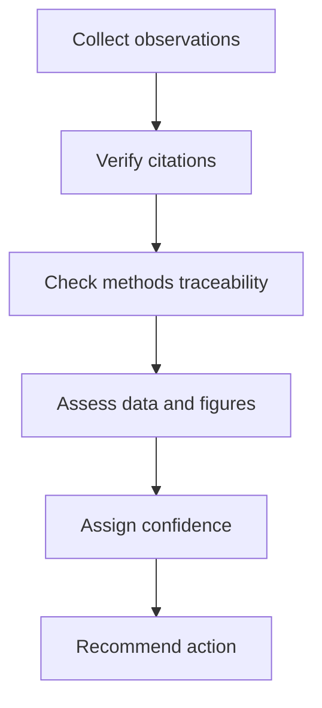

# Integrity Triage Flow Diagram

```mermaid
flowchart TD
  A[Collect observations] --> B[Verify citations]
  B --> C[Check methods traceability]
  C --> D[Assess data and figures]
  D --> E[Assign confidence]
  E --> F[Recommend action]
```
